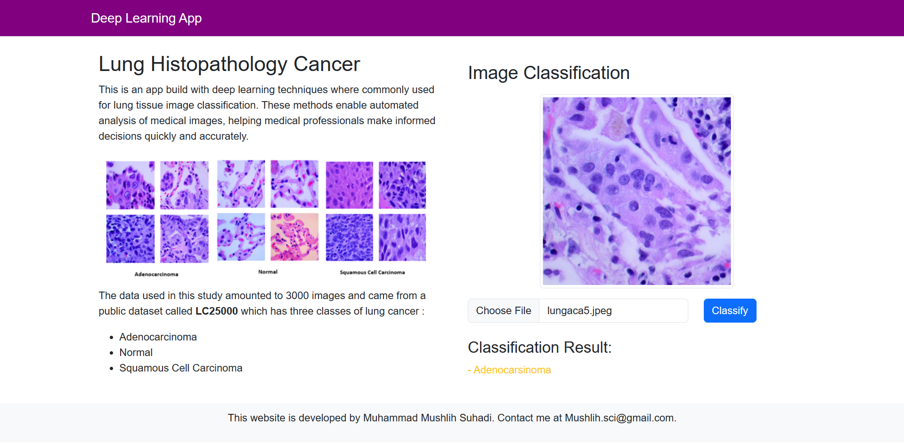

# Lung-Histopathology-Cancer-Classification

This app build with django and Tensorflow framework

Im currently deep learning techniques where commonly used for lung tissue image classification. These methods enable automated analysis of medical images, helping medical professionals make informed decisions quickly and accurately.

The Deep learning model used in this project build with 3000 images and came from a public dataset called LC25000
